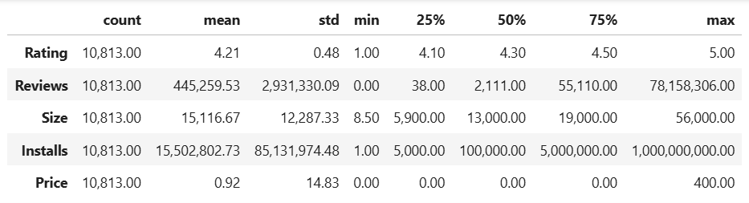
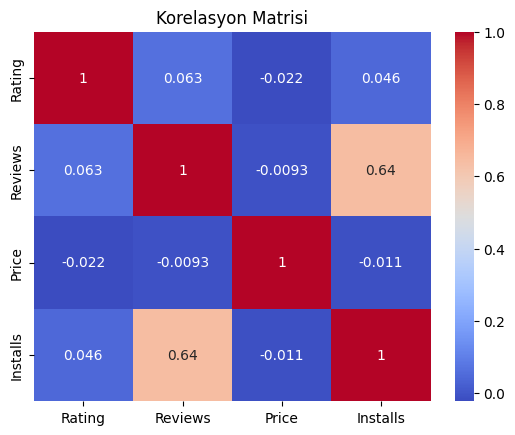
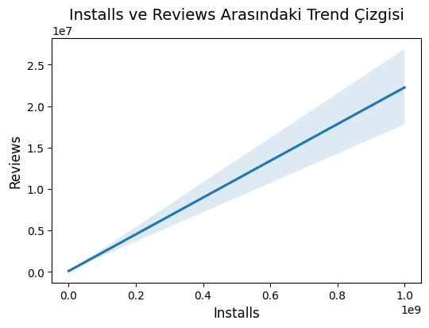
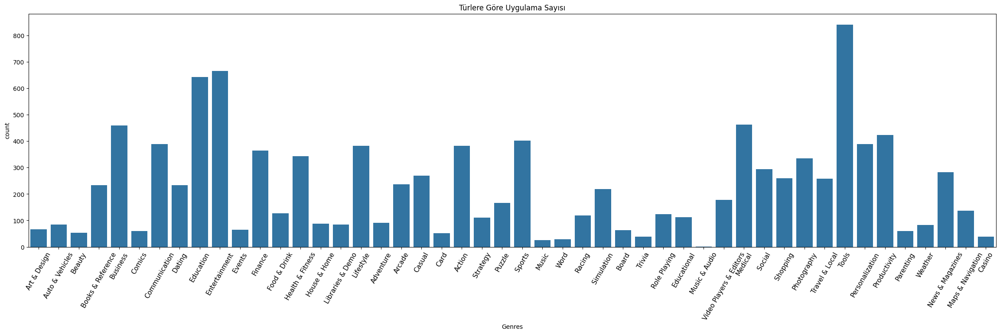
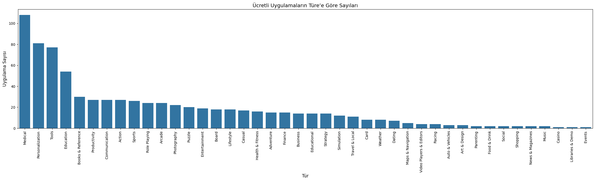
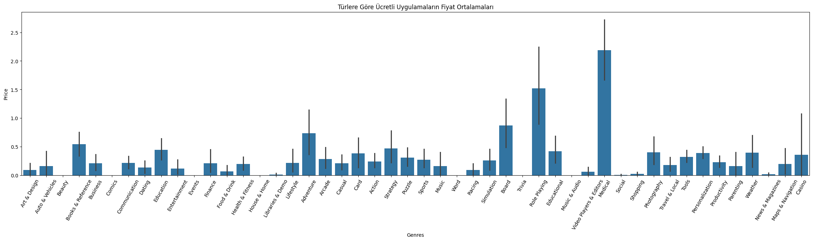
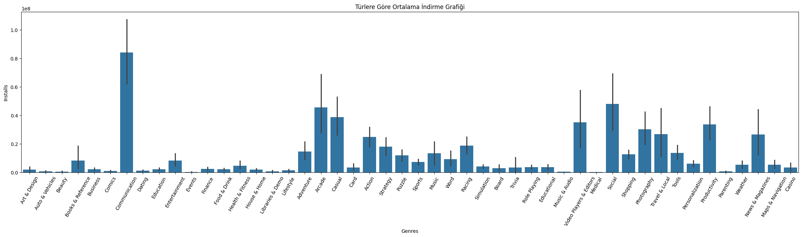
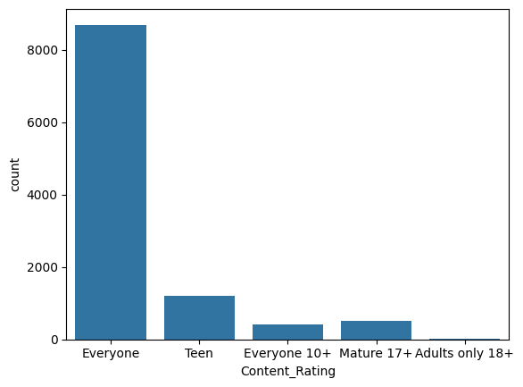
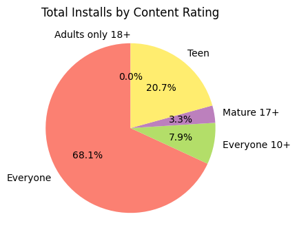
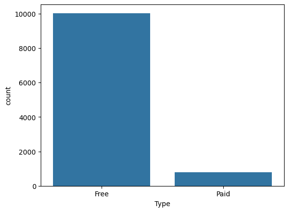

# Google Play Store Analysis Project

### Project Overview
---
Analyzing and pre processing Google Play Store dataset to gain insights into app ratings, reviews, and category performance.

### Data Source

The dataset we use for analysis is "googleplaystore.csv".In this dataset each app has values for category, rating, size, and more.

- [Dataset's kaggle page](https://www.kaggle.com/datasets/lava18/google-play-store-apps)

### Data Cleaning/Preparation

In the initial data preparation phase, we performed the following tasks:
1. Data loading and inspection.
2. Handling missing values.
3. Data cleaning and formatting.

### Exploratory Data Analysis

EDA involved exploring the sales data to answer key questions, such as:

- What is the mean of installs by genres?
- Are there any correlations between the variables?

### Results/Findings

#### Descriptive Statistics

#### Correlations
Upon analyzing the cleaned dataset, as seen in the image below, the only notable correlation is the moderately strong positive correlation between 'Reviews' and 'Installs'.

#### Trend Line

#### Findings
 - According to the chart below, the genre with the most apps is 'Tools'
   
   

   
 - According to the chart below, the genre with the most paid apps is 'Medical
 
   

 - According to the chart below, the genre with the highest average price is 'Medical'

   

 - According to the chart below, the genre with the highest average number of installs is 'Communication'

   
   

  - According to the chart below, the content rating with the most apps by far is 'Everyone'

    
   

  - According to the pie chart below, the content rating with the most downloads by far is 'Everyone'

    

  - According to the chart below, by far, the number of free apps is higher

    

   
 

