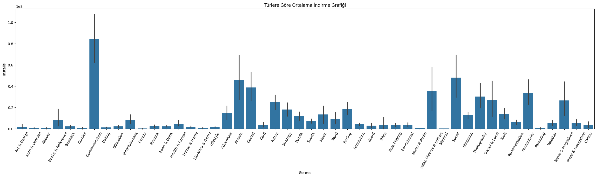
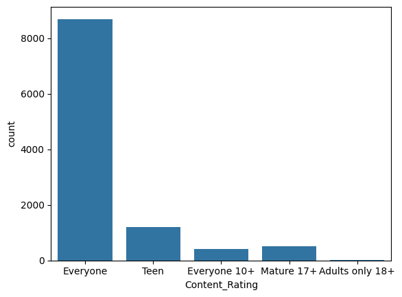

# Google Play Store Analysis Project

### Proje Genel Bakışı
---
Google Play Store verisetini analiz ederek, uygulama puanları, yorumları ve kategori performansları hakkında bilgiler elde edilmesi.

### Veri Kaynağı

Analiz için kullandığımız veri seti "googleplaystore.csv" dosyasıdır. Bu veri setinde her bir uygulama için kategori, puan, boyut ve daha fazlasına dair bilgiler bulunmaktadır.

- [Veri setinin Kaggle sayfası](https://www.kaggle.com/datasets/lava18/google-play-store-apps)

### Veri Temizliği ve Hazırlığı

İlk veri hazırlık aşamasında, aşağıdaki işlemleri gerçekleştirdik:
1. Veriyi yükleme ve inceleme.
2. Eksik verilerin işlenmesi.
3. Veri temizliği ve formatlama.

### Keşifsel Veri Analizi (EDA)

EDA, satış verilerini keşfederek aşağıdaki temel soruları yanıtlamayı içeriyordu:

- Türlere göre yüklemelerin ortalaması nedir?
- Değişkenler arasında herhangi bir korelasyon var mı?

### Sonuçlar/Bulgular

#### Tanımlayıcı İstatistikler

#### Korelasyonlar
Temizlenmiş veri seti analiz edildiğinde, aşağıdaki görselde görüldüğü gibi, dikkat çeken tek korelasyon 'Yorumlar' ve 'Yüklemeler' arasında orta derecede güçlü pozitif bir korelasyondur.

#### Trend Çizgisi

#### Bulgular
- Aşağıdaki grafiğe göre, en fazla uygulamaya sahip kategori 'Tools' (Araçlar) kategorisidir.

   

- Aşağıdaki grafiğe göre, en fazla ücretli uygulama bulunan kategori 'Medical' (Tıp) kategorisidir.

   

- Aşağıdaki grafiğe göre, en yüksek ortalama fiyatı olan kategori 'Medical' (Tıp) kategorisidir.

   

- Aşağıdaki grafiğe göre, en yüksek ortalama yükleme sayısına sahip kategori 'Communication' (İletişim) kategorisidir.

   

- Aşağıdaki grafiğe göre, en fazla uygulamaya sahip içerik derecelendirmesi 'Everyone' (Herkes) dir.

   

- Aşağıdaki pasta grafiğine göre, en fazla indirme sayısına sahip içerik derecelendirmesi 'Everyone' (Herkes) dir.

   

- Aşağıdaki grafiğe göre, ücretsiz uygulamaların sayısı çok daha fazladır.

   

#### Sonuç

- **Ücretli ve Ücretsiz Uygulamalar Arasındaki Farklar:** Ücretli ve ücretsiz uygulamalar arasında belirgin bir fark vardır. Ücretsiz uygulamalar, toplam uygulama sayısının büyük bir kısmını oluşturur. Diğer taraftan, ücretli uygulamalar daha az sayıda olup, her kategoriye göre önemli bir paya sahiptir. Ücretsiz uygulamalar genellikle daha fazla çeşitliliğe sahipken, ücretli uygulamalar daha sınırlı sayıda olup belirli kategorilere odaklanmıştır.

- **Uygulama Türlerine Göre Dağılım:** Ücretli ve ücretsiz uygulamaların türlerine göre dağılımını incelediğimizde, "Tools" (Araçlar), "Entertainment" (Eğlence) ve "Education" (Eğitim) kategorilerinin her iki türde de en yaygın türler olduğu görülmektedir. "Medical" (Tıp) türü, ücretli uygulamalarda oldukça yaygınken, ücretsiz uygulamalarda daha az yer almaktadır. Ayrıca, "Games" (Oyunlar) türü, ücretsiz uygulamalar arasında oldukça baskındır.

- **Uygulama Fiyatları:** Ücretli uygulamaların ortalama fiyatları büyük çeşitlilik göstermektedir. Özellikle "Medical" (Tıp) ve "Video Players & Editors" (Video Oynatıcılar ve Düzenleyiciler) kategorilerinde fiyat ortalamaları belirgin şekilde yüksektir. Diğer taraftan, bazı türlerde fiyatlar çok düşük veya ücretsizdir ve genellikle sıfır ya da minimal ücretlerle piyasaya sürülmektedir.

- **İndirilen Uygulamalar:** Türlere göre yükleme sayısını incelediğimizde, "Communication" (İletişim) kategorisinin en fazla yükleme sayısına sahip olduğu görülmektedir. Bunun yanında, "Tools" (Araçlar), "Entertainment" (Eğlence) ve "Education" (Eğitim) kategorileri de oldukça yüksek indirme sayıları göstermektedir.

- **Yüklemeler ve Yorumlar Arasındaki İlişki:** Yüklemeler ve yorumlar arasında pozitif bir ilişki gözlemlenmiştir. Bir uygulamanın yüklenme sayısı arttıkça, yorum sayısının da arttığı görülmektedir. Bu trend genellikle popüler ve yaygın olarak indirilen uygulamalar için geçerlidir. Bu ilişkiyi görselleştiren trend çizgisi, korelasyonu net bir şekilde doğrulamaktadır. Bu durum, kullanıcıların uygulamaları daha fazla indirdikçe, daha fazla geri bildirimde bulunma eğiliminde olduklarını göstermektedir.
